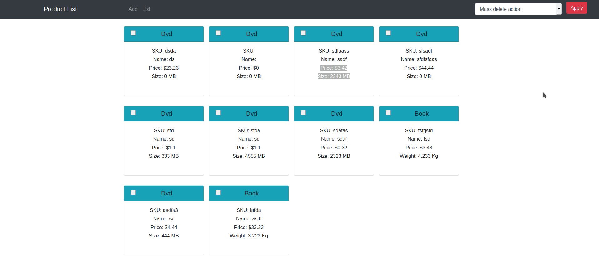
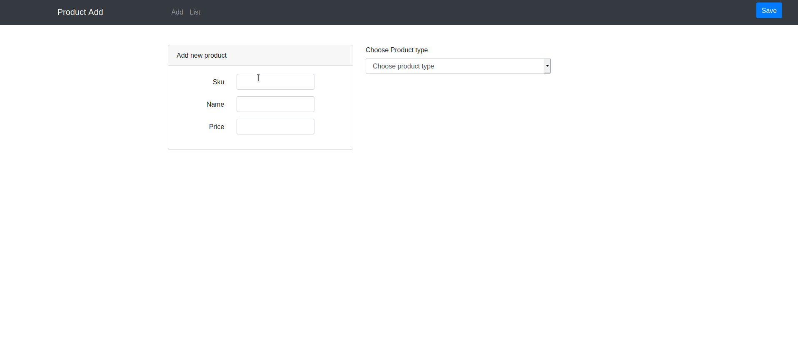
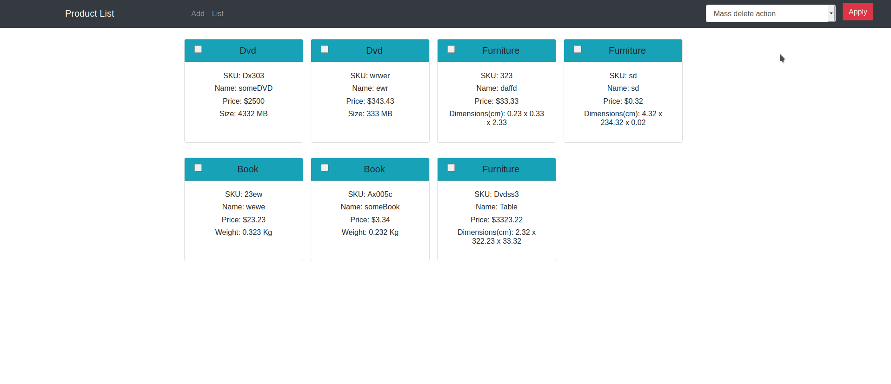

# Product_Storage
## Some functionality gifs

- - - -

To run app:
* git clone https://github.com/vanhell86/Product_Storage.git
* run composer install
* change your database credential in config/database.example.php and after that rename it to database.php. Table will be created automatically.
